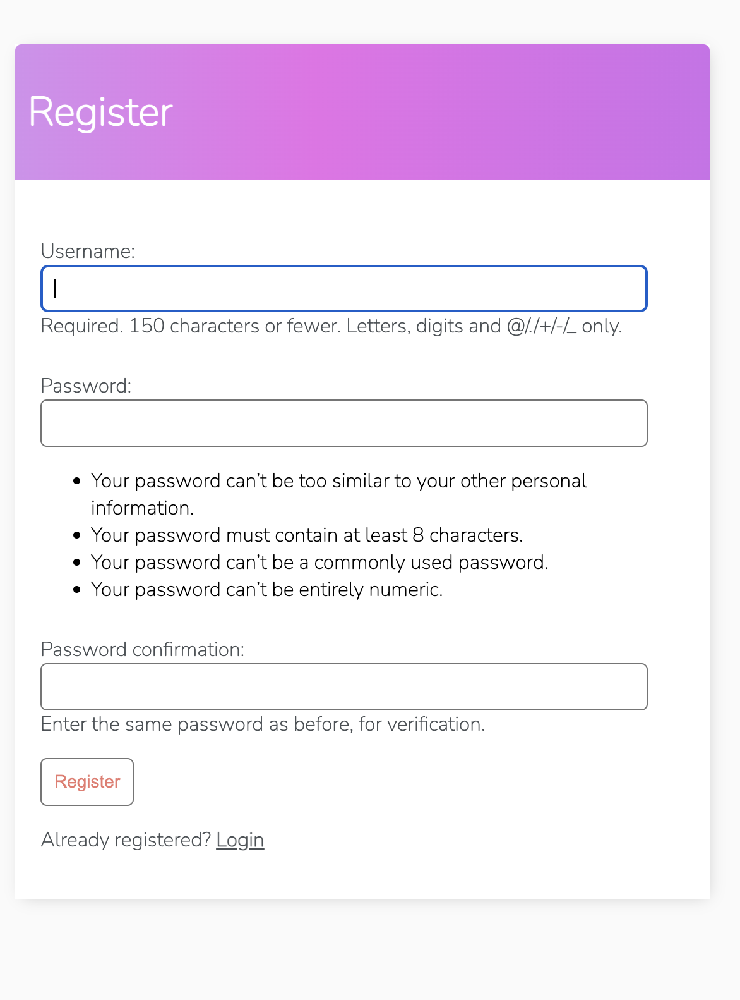
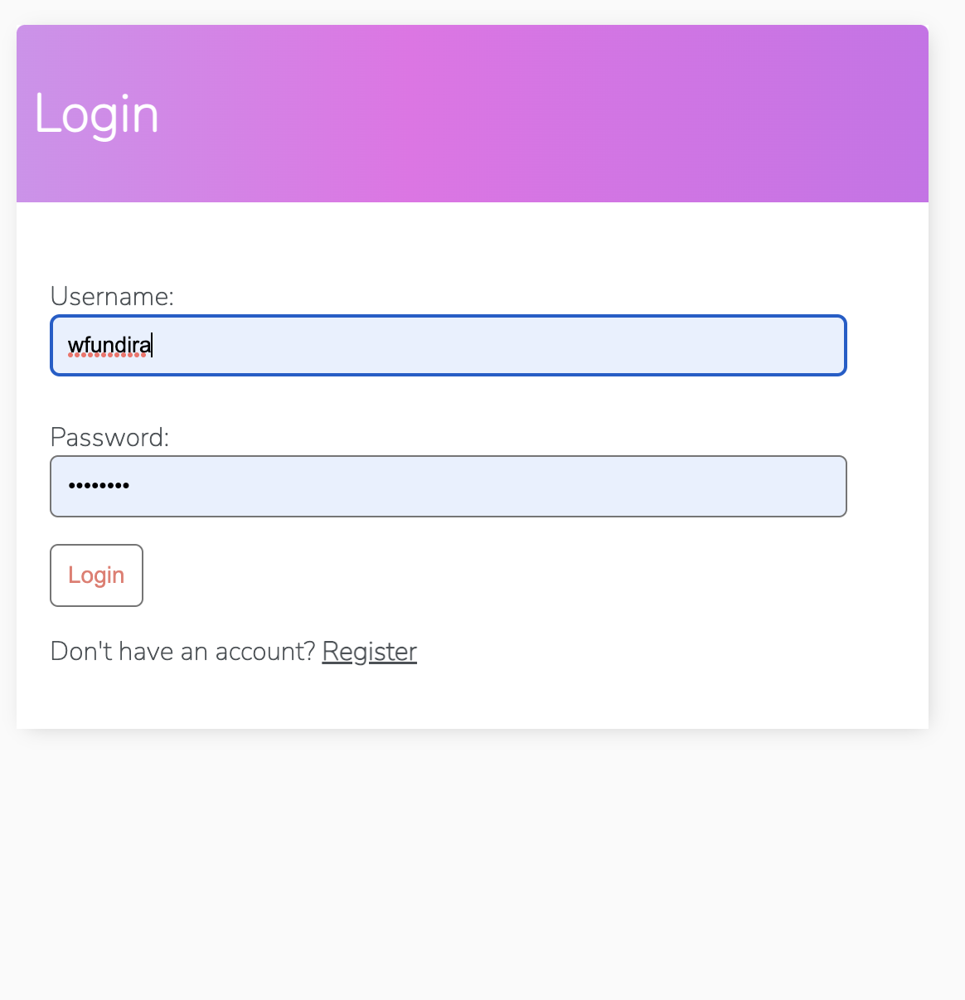
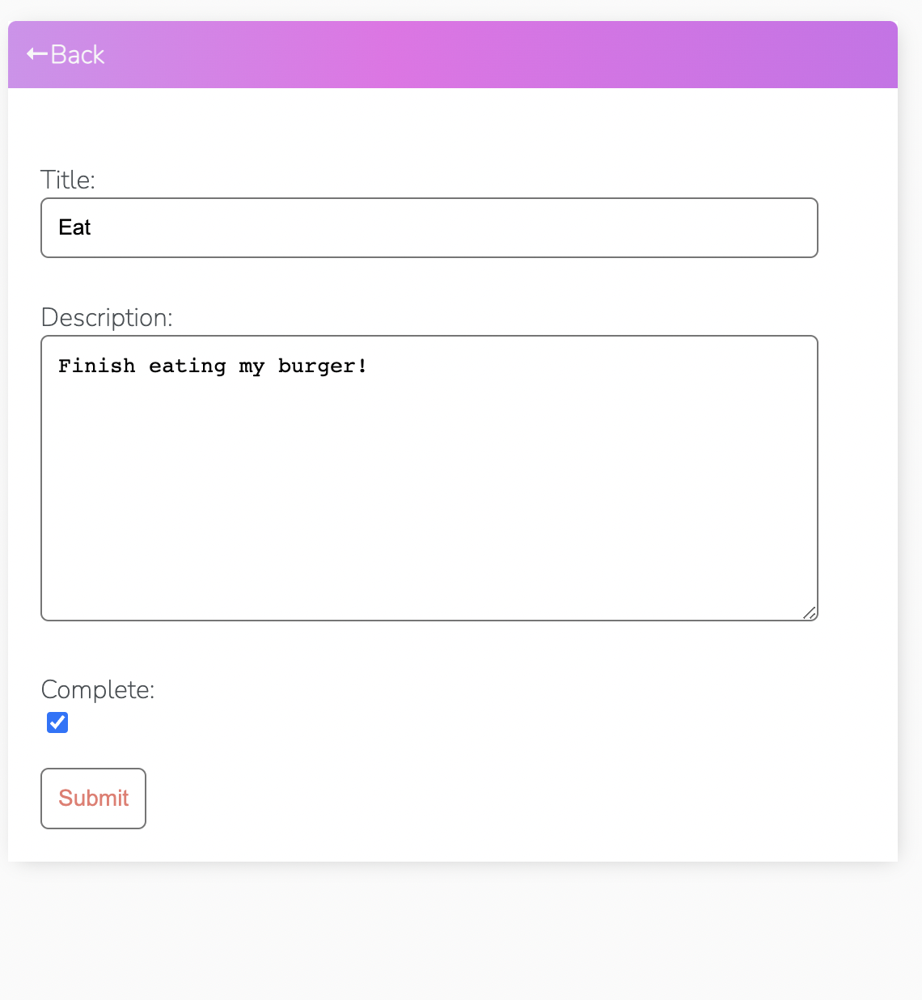
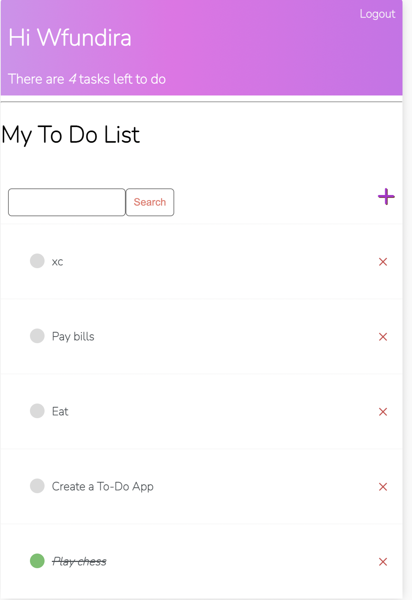
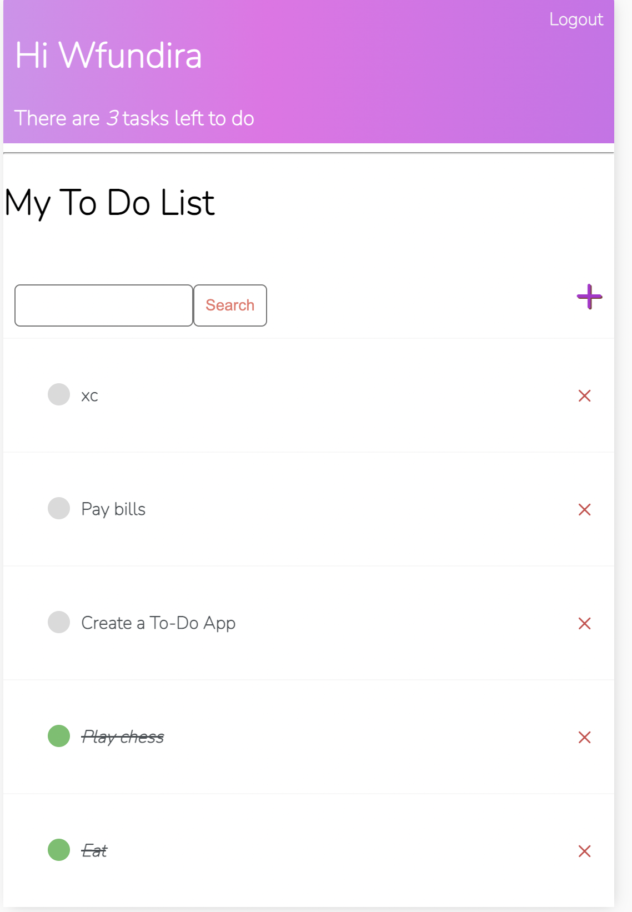

# Tasky
Tasky is a simple to-do-list app written primarily in HTML and Python, with some CSS styling.
Tasky allows authenticated users to create, edit , delete and update tasks in a basic form of CRUD Database Management. 

I utilized class based views instead of the conventional function based views by following Django Documentation found at the link below: 

https://docs.djangoproject.com/en/4.1/topics/class-based-views/

A significant advantage of using class based views is the ability to use inheritance to reuse code in your boilerplate without having to write it again.

Below is a brief montage of the app in use:

Registration

Login

Edit Task

Updated Main view

New User Login

